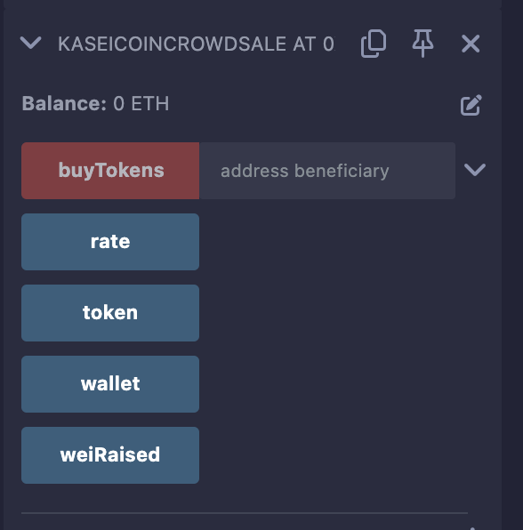

# Unit 21: Martian Token Crowdsale

## Background

After waiting for years and passing several tests, the Martian Aerospace Agency selected you to become part of the first human colony on Mars. As a prominent fintech professional, they chose you to lead a project developing a monetary system for the new Mars colony. You decided to base this new system on blockchain technology and to define a new cryptocurrency named **KaseiCoin**. (Kasei means Mars in Japanese.)

KaseiCoin will be a fungible token that’s ERC-20 compliant. You’ll launch a crowdsale that will allow people who are moving to Mars to convert their earthling money to KaseiCoin.

## Files

Please find completed code for the KaseiCoin contract within the KaseiCoin.sol file, and the Crowdsale and Deployer contracts in the KaseiCoinCrowdsale.sol file.

## Evaluation Evidence

### Step 1: Create the KaseiCoin Token Contract

Proof of successful compilation of the KaseCoin contract below. 

### Step 2: Create the KaseiCoin Crowdsale Contract

Proof of successful compilation of the KaseiCoin Crowdsale contract below. 

### Step 3: Create the KaseiCoin Deployer Contract

Proof of successful compilation of the KaseiCoin Deployer contract below. 

### Step 4: Deploy and Test the Crowdsale on a Local Blockchain

1. Deploy the crowdsale to a local blockchain by using Remix, MetaMask, and Ganache.

Proof of successfully deployed contract.

2. Test the functionality of the crowdsale by using test accounts to buy new tokens and then checking the balances of those accounts.

Contract changed from "deployer" to "crowdsale" with crowdsale contract address entered for "At Address" to be able to buy Tokens and interact with the contract.

Proof of being able to interact with contract below. 

Test transaction, value of 10 Ether.

Confirm transaction via MetaMask. 

4. Review the total supply of minted tokens and the amount of wei that the crowdsale contract has raised.

After successful interaction of 10 Ether, can see the amount of wei the crowdsale contract has raised. 
